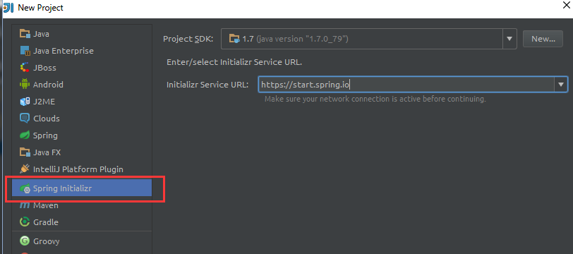

# Gradle SpringBoot Jsp

This is a example project that Springboot integrate Jsp.

从下图中可以看出，官网支持`Freemarker`、`Velocity`、`Groovy`、`Thymeleaf`、`Mustache`，如果需要使用jsp，必须单独配置


### 1.新建工程




### 2.添加依赖

修改`build.gradle`
```gradle
compile(
    'org.apache.tomcat.embed:tomcat-embed-jasper'
)
```

### 3.application.properties配置

`spring.mvc.view.prefix=/WEB-INF/jsp/`
`spring.mvc.view.suffix=.jsp`

### 4.编写代码


#### controller
```java
@Controller
public class UserController {

    @RequestMapping("hello")
    public String hello(Model model, String name) {
        model.addAttribute("name", name);
        return "hello";
    }
}
```
### jsp
```
<%@ page language="java" contentType="text/html; charset=UTF-8"
         pageEncoding="UTF-8"%>
<!DOCTYPE html PUBLIC "-//W3C//DTD HTML 4.01 Transitional//EN""http://www.w3.org/TR/html4/loose.dtd">
<html>
    <head>
        <meta http-equiv="Content-Type" content="text/html; charset=UTF-8">
        <title>Insert title here</title>
    </head>
    <body>
        helloJsp
        <hr>
        ${name}
    </body>
</html>
```

### 5.结果


